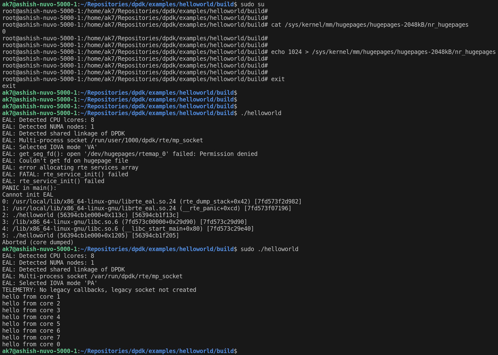
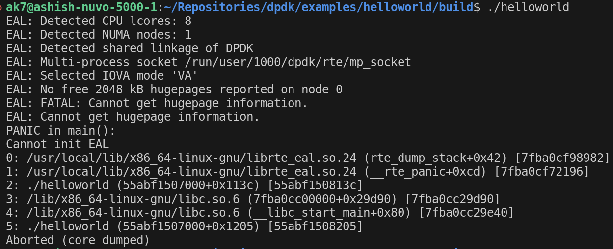
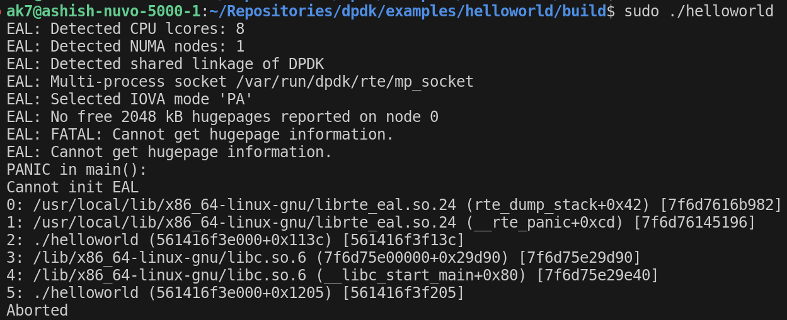

# Experiments-with-DPDK
This repo captures the different experiments with DPDK on Logic Supply.

### Prerequisites

- Enable HUGEPAGES
    ```
    sudo su
    echo 1024 > /sys/kernel/mm/hugepages/hugepages-2048kB/nr_hugepages
    ```
- Install pkgconf
    ```
    sudo apt install pkgconf
    ```
### Compiling DPDK

+ First we go to the root of the `dpdk` and perform the following steps

    ```
    meson setup build
    cd build/
    ninja
    sudo meson install
    ```

+ Now, we can go into an example to compile it against `dpdk`. For example, `helloworld` can be compiled as:

    ```
    cd dpdk/examples/helloworld/build
    make
    sudo ./helloworld
    ```


+ A successful compilation and run would show the following:

    

### Common Issues

+ Without hugepages, `dpdk` would give an error as follows:

    

    -  Even with `sudo` privileges:

        


+ One needs to include <pcap.h> in the headers to run a DPDK application, which can be installed by:

    ```
    sudo apt-get install libpcap-dev
    ```

### Running L2-fwd Application

+ The L2fwd application on DPDK requires the ethernet port to be discoverable by the DPDK driver
+ This involves unbindling the ethernet device from the kernel and then bind the ethernet port to the vfio-pci driver. ```dpdk-devbind.py --status``` will give information about the different interface
    - ```dpdk-devbind.py --bind=vfio-pci <eth interface>```
    - If there is no IOMMU on the system, this will fail and so one has to do this via ```echo 1 > /sys/module/vfio/parameters/enable_unsafe_noiommu_mode```
    - Now trying the ```dpdk-devbind.py``` script will work
